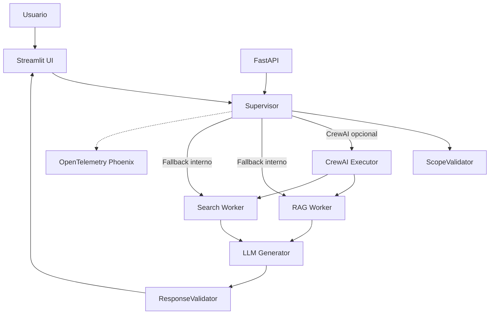

# Arquitetura

Este projeto implementa um chatbot sobre Copa do Mundo com uma interface Streamlit, uma API FastAPI opcional e uma camada de workers para combinar RAG local, busca web e geracao de respostas estruturadas.

## Visao Geral



## Componentes

- `app.py`: interface Streamlit usada na demo e no Dockerfile.
- `main.py`: API FastAPI com endpoints `/health`, `/chat` e `/chat/batch`.
- `crew/supervisor.py`: orquestra as consultas, escolhe workers e aplica fallback.
- `crew/scope_validator.py`: restringe o escopo para perguntas sobre Copa do Mundo, FIFA e Copa 2026.
- `crew/rag_worker.py`: consulta a base local em `data/`, usando FAISS quando disponivel.
- `crew/search_worker.py`: usa Serper para busca web quando `SERPER_API_KEY` esta configurada; caso contrario, entra em modo simulado.
- `crew/llm_generator.py`: consolida respostas com OpenAI quando `OPENAI_API_KEY` esta configurada; caso contrario, retorna uma resposta simulada.
- `crew/response_validator.py`: valida e ajusta respostas no formato JSON esperado.
- `crew/observability.py`: configura logs, traces e metricas via OpenTelemetry e Phoenix.

## Fluxo de Resposta

1. A pergunta chega pela UI Streamlit ou pela API FastAPI.
2. O `Supervisor` valida o escopo da pergunta.
3. A consulta e enviada para RAG, busca web ou ambos, dependendo do tipo de pergunta.
4. O resultado e consolidado pelo gerador de LLM ou por fallback simulado.
5. O `ResponseValidator` tenta garantir uma resposta estruturada e apresentavel.
6. Logs, traces e metricas podem ser enviados para Phoenix quando configurados.

## Dados e RAG

Os documentos base ficam em `docs/`. Os artefatos gerados ficam em `data/`:

- `data/embeddings.json`
- `data/faiss/index.faiss`
- `data/faiss/metadata.json`

Para regenerar a base:

```bash
python scripts/ingest_rag.py
python scripts/build_faiss_index.py
```

## Modo Demo

O projeto pode iniciar sem `OPENAI_API_KEY` e `SERPER_API_KEY`, mas nesse caso algumas respostas usam fallback simulado. Esse modo e util para demonstrar interface, fluxo de orquestracao e estrutura do sistema sem consumir APIs pagas.

Para uso completo, configure as chaves no ambiente local, no Docker ou nos Secrets do Hugging Face Spaces.
