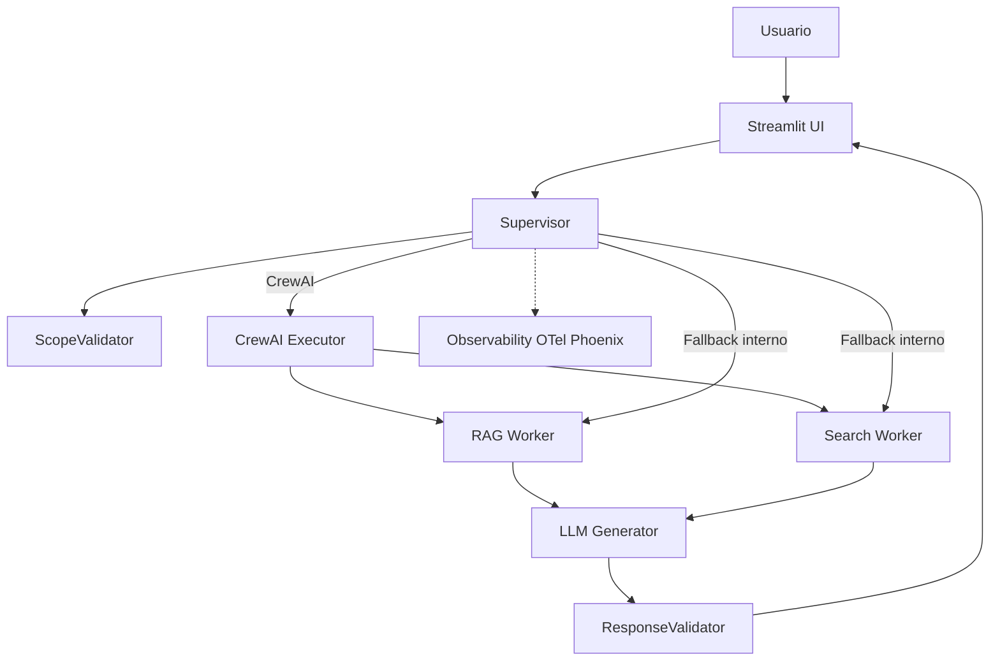

# FIFA World Cup Chatbot

Assistente multiagente para perguntas sobre Copa do Mundo (historia e Copa 2026), com RAG local, busca web e UI multilingue.

<p align="center">
  
</p>

> Demo publica: https://huggingface.co/spaces/desafio-gensquads/Byte-Researcher
>
> Sem `OPENAI_API_KEY` e `SERPER_API_KEY`, o app ainda inicia em modo demo/simulado para apresentar a interface e o fluxo do sistema. Para respostas reais com LLM, RAG semantico e busca web, configure as chaves de API.

---

## Sumario

- [Visao geral](#visao-geral)
- [Arquitetura](#arquitetura)
- [Funcionalidades](#funcionalidades)
- [Stack](#stack)
- [Execucao local](#execucao-local)
- [Execucao com Docker](#execucao-com-docker)
- [Hugging Face Spaces](#hugging-face-spaces)
- [Modo demo sem chaves](#modo-demo-sem-chaves)
- [RAG e dados](#rag-e-dados)
- [API](#api)
- [Variaveis de ambiente](#variaveis-de-ambiente)
- [Observabilidade (Phoenix)](#observabilidade-phoenix)
- [Estrutura do projeto](#estrutura-do-projeto)
- [Testes](#testes)
- [Troubleshooting](#troubleshooting)

## Visao geral

- Roteamento inteligente entre RAG e Web (Serper).
- Resposta estruturada em JSON (`answer`, `main_facts`, `related_topics`, `pages`, `links`).
- UI Streamlit com entrada e saida por voz e traducao automatica.
- Observabilidade via OpenTelemetry + Phoenix.

## Arquitetura



Fluxo principal:
1. `Supervisor` valida o escopo da pergunta.
2. Decide a fonte (RAG, Web ou fallback).
3. `LLMGenerator` consolida a resposta.
4. `ResponseValidator` garante estrutura JSON.

Detalhes em `ARCHITECTURE.md`.

## Funcionalidades

- RAG local com embeddings + FAISS (`data/`).
- Busca web em tempo real com Serper.
- Orquestracao por CrewAI com fallback interno.
- Resposta estruturada em JSON.
- UI Streamlit multilingue com voz (STT/TTS).
- Observabilidade (OTel + Phoenix).

## Stack

- Python 3.11+
- Streamlit + FastAPI
- OpenAI API
- CrewAI
- FAISS
- Serper API
- OpenTelemetry + Phoenix

## Execucao local

### 1) Ambiente

```bash
python3 -m venv .venv
source .venv/bin/activate
pip install -r requirements.txt
```

### 2) Variaveis

```bash
cp .env.example .env
```

Defina no minimo:

```env
OPENAI_API_KEY=...
SERPER_API_KEY=...
```

### 3) Rodar UI (Streamlit)

```bash
streamlit run app.py
```

Acesse: `http://localhost:8501`

### 4) Rodar API (FastAPI)

```bash
uvicorn main:app --reload
```

- Docs: `http://localhost:8000/docs`
- Health: `http://localhost:8000/health`

## Execucao com Docker

### Build

```bash
docker build -t fifa-world-cup-chatbot .
```

### Run

```bash
docker run --rm -p 8501:8501 --env-file .env fifa-world-cup-chatbot \
  streamlit run app.py --server.address=0.0.0.0 --server.port=8501 --server.headless=true
```

Observacao: se alterar o arquivo de entrada da UI, ajuste o comando acima ou o `CMD` do `Dockerfile`.

## Hugging Face Spaces

- O Spaces (SDK Docker) usa o `Dockerfile` do repositorio.
- Garanta que o entrypoint esteja alinhado com o arquivo correto da UI (`app.py`).
- Configure `OPENAI_API_KEY`, `SERPER_API_KEY` e, se usar Phoenix Cloud, `PHOENIX_API_KEY` em Settings > Variables and secrets.

## Modo demo sem chaves

Se nenhuma chave de API estiver configurada, o projeto continua inicializando e usa respostas simuladas em partes do fluxo. Esse modo e suficiente para demonstrar:

- Interface Streamlit.
- Orquestracao entre supervisor, RAG e busca.
- Estrutura das respostas.
- Observabilidade local opcional.

Limites do modo demo:

- A geracao com OpenAI nao sera executada.
- A busca web real via Serper nao sera executada.
- A qualidade das respostas nao representa o modo completo com chaves configuradas.

## RAG e dados

Documentos base em `docs/`. Exemplo atual:
- `docs/Seminar_DCSD_Foot_20170126.pdf`

Os PDFs e o indice FAISS usam Git LFS. Depois de clonar o repositorio, se necessario:

```bash
git lfs install
git lfs pull
```

Para regenerar artefatos:

```bash
python scripts/ingest_rag.py
python scripts/build_faiss_index.py
```

Arquivos gerados:
- `data/embeddings.json`
- `data/faiss/index.faiss`
- `data/faiss/metadata.json`

Para adicionar novos documentos, coloque-os em `docs/` e rode novamente os scripts acima.

## API

### POST `/chat`

Request:

```json
{ "query": "Quem venceu a Copa de 2002?" }
```

Response (exemplo):

```json
{
  "ok": true,
  "result": {
    "result": "...",
    "context_source": "rag"
  }
}
```

### POST `/chat/batch`

Request:

```json
{
  "items": [
    { "query": "Quem venceu a Copa de 1994?" },
    { "query": "Quais cidades sediam a Copa 2026?" }
  ]
}
```

## Variaveis de ambiente

Obrigatorias:

```env
OPENAI_API_KEY=...
SERPER_API_KEY=...
```

Recomendadas:

```env
LLM_MODEL=gpt-4.1-nano
LLM_TEMPERATURE=0.3
APP_TIMEZONE=America/Sao_Paulo
NUM_WORKERS=2
```

RAG:

```env
RAG_USE_FAISS=true
RAG_TOP_K=3
CHUNK_SIZE=500
CHUNK_OVERLAP=100
```

Busca:

```env
SEARCH_TOP_K=3
```

CrewAI:

```env
USE_CREWAI=true
CREWAI_STORAGE_DIR=.crewai
CREWAI_TRACING_ENABLED=true
```

Observabilidade:

```env
PHOENIX_ENABLED=true
PHOENIX_PROJECT_NAME=...
PHOENIX_COLLECTOR_ENDPOINT=...
OTEL_EXPORTER_OTLP_METRICS_ENDPOINT=...
PHOENIX_API_KEY=...
METRICS_ENABLED=true
LOG_LEVEL=INFO
```

Cache e contexto:

```env
CACHE_ENABLED=true
CACHE_TTL_SECONDS=300
RAG_CACHE_TTL_SECONDS=300
SEARCH_CACHE_TTL_SECONDS=300
QUERY_REWRITE_ENABLED=true
CONTEXT_TTL=3
```

Seguranca: nunca versione chaves reais. Use `.env` local e mantenha segredos fora do repositorio.

## Observabilidade (Phoenix)

### Cloud

Configure as variaveis de ambiente e rode a aplicacao normalmente.

### Local

```bash
bash scripts/phoenix.sh up
```

Acesse: `http://localhost:6006`

Nota: o `docker-compose.yml` deste repo e usado apenas para subir o Phoenix local.

## Estrutura do projeto

```text
.
├─ app.py
├─ main.py
├─ crew/
├─ scripts/
├─ docs/
├─ data/
├─ front/
├─ docker-compose.yml
├─ Dockerfile
├─ requirements.txt
├─ ARCHITECTURE.md
└─ README.md
```

## Testes

```bash
pytest -q
```

## Troubleshooting

- `SERPER_API_KEY` ausente: Web Search entra em modo simulado.
- FAISS ausente: RAG usa busca linear/hibrida.
- `OPENAI_API_KEY` ausente: geracao LLM falha ou simula resposta.
- Voz: verifique dependencias `SpeechRecognition`, `gTTS`, `pydub` e `audio-recorder-streamlit`.
